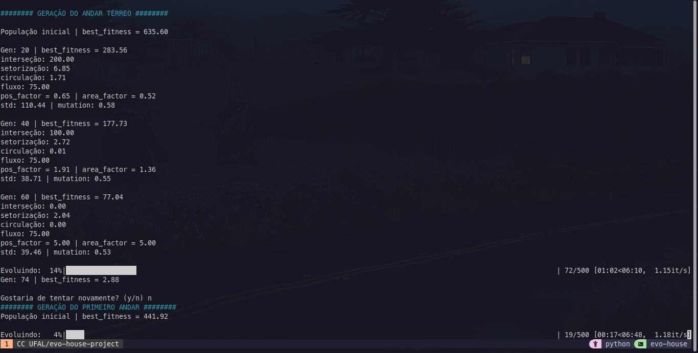
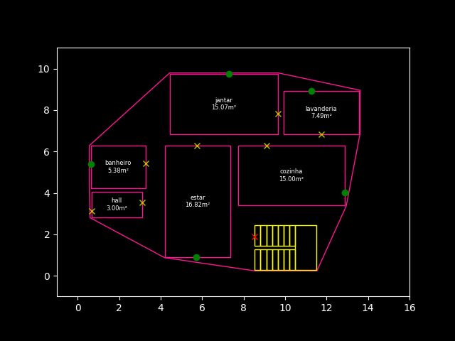
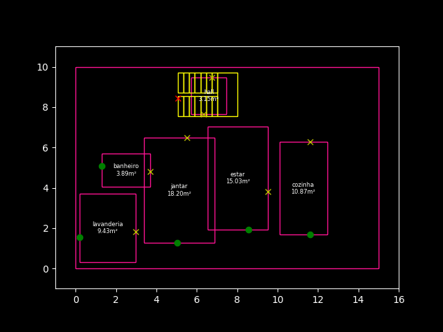

# Evo House

Gerador de plantas baixas para uma casa de 2 andares e 1 laje.

- 0: então você irá desenhar a planta de uma casa com 2 andares e uma laje;
- 1: então a casa terá uma sala de ginástica;
- 3: então a casa terá 2 quartos, 3 banheiro, 1 closet

## Instalação

- Certifique-se de que tem o [Poetry](https://python-poetry.org/docs/) instalado
- Clone o repositório: `git clone https://github.com/renalvojr/evo-house.git`
- Rode os comandos do poetry: `poetry install` e `poetry shell`

## Como Usar ?

```bash
python -m evo_house
```



## O Algoritmo

### Representação

A casa é representada através de seus andares (Floors),
onde cada andar possui um conjunto fixo de cômodos (Rooms)
e uma escada (Stairs). Cada cômodo possui atributos que determinam
seu lugar no espaço da casa, bem como suas dimensões, porta e janela
e _id_ (para diferenciação em relação a cômodos semelhantes)


#### Geração de Cômodos

Inicialmente, é determinada a área do cômodo, **aleatoriamente**,
seguindo os limites para o tipo do cômodo, bem como a proporção entre
altura e largura, de modo que:

$$
width = (area \cdot proprotion)^2
$$

$$
height = \dfrac{area}{width}
$$

Em seguida, é determinada a posição (canto inferior esquerdo) do cômodo,
sendo determinada aleatoriamente entre o menor ponto da região da casa e
o maior ponto que possibilite a total alocação do cômodo dentro do andar.

```python
x, y = [
        random.uniform(xmin, max_width - width),
        random.uniform(ymin, max_height - height),
    ]
```

Por fim, a posição da porta e janela é determinada de modo que:

- a **janela** é posicionada em um ponto aleatório na lateral menos distante
  dos limites da casa, possibilitando que ela esteja possivelmente para a
  parte externa da casa;
- a **porta** é posicionada em um ponto aleatório em uma das 2 laterais mais
  distantes dos limites da casa, possibilitando que ela esteja possivelmente
  para a parte interna da casa;

#### Geração de Escada

A área da escada, bem como largura e altura são fixas, sendo a escolha da posição
semelhante a dos cômodos. A posição da **porta** depende unicamente da **orientação**
da escada, enquanto a janela se torna inativa.

#### Geração de Andares

Um andar recebe uma lista de cômodos e esses são gerados seguindo o processo descrito
anteriormente. A escada pode ser passada como parâmetro, ou gerada
internamente ao cômodo

#### Representação Fenotípica

Os andares são desenhados utilizando a biblioteca `matplotlib` do python, onde cada
cômodo é representado através de retângulos, com a informação do nome e área centralizada,
bem como a janela (círculo verde) e a porta (X amarelo). A escada tem formato próprio,
seguindo a representação em plantas baixas, com sua entrada (X vermelho).



### Adaptação

A função de adaptação (_fitness_) é definida através de 4 verificações:

1. Interseção
2. Setorização
3. Circulação
4. Fluxo

Cada uma delas possibilita uma penalização (positiva) a estrutura de um andar,
de modo que o objetivo se torna minimizar esse valor

#### Interseção

Consiste na penalização referente a quantidade de interseções presentes entre
cômodos, utilizando a técnica _Axis-Aligned Bounding Box_ (AABB) de verificação
de colisões. A cada interseção detectada, é atribuído 100 pontos a penalização total
do andar.

##### AABB

Dados dois retângulos A, B, definidos:

$A = (x_A, y_A, width_A, height_A)$

$B = (x_B, y_B, width_B, height_B)$

Então há colisão quando:

$$
max(x_A, x_B) < min(x_A + width_A, x_B + width_B) \land \\
max(y_A, y_B) < min(y_A + height_A, y_B + height_B)
$$

#### Setorização

Consiste na penalização referente a distância entre cômodos pertencentes a um
mesmo setor (social, serviço ou privativo). A distância dois a dois entre os cômodos
de um mesmo setor é calculada e somada, objetivando-se a minimização da mesma

<center>

</center>

##### Distância entre Cômodos

A distância entre dois cômodos é calculada através das suas laterais, de modo que
representa a maior distância entre as distâncias presentes nas laterais dos cômodos:

```python
  ...
  horizontal_dis = max(x2_min - x1_max, x1_min - x2_max)
  vertical_dis = max(y2_min - y1_max, y1_min - y2_max)

  return max(horizontal_dis, vertical_dis)
```

#### Circulação

Consiste na penalização referente a presença de espaços vazios entre cômodos, grandes o
suficiente para possibilitar a existência de um terceiro cômodo. Desde modo, objetiva-se
a aproximação total ou parcial (presença de corredores) entre os cômodos.

Dois a dois os cômodos são comparados, onde é calculada a distância entre eles. É verificado
se existem cômodos no caminho entre os dois comparados, para determinar se a distância encontrada
corresponde verdadeiramente a um espaço vazio. Se sim, caso a distância não seja uma parede `[0, 0.6]`
ou um corredor `[0.8, 1.2]`, o andar é penalizado em 50 vezes o valor da distância:

```python
 for i in range(FLOOR_SIZE - 1):
      for j in range(i + 1, FLOOR_SIZE):
          distance = get_rooms_distance(floor[i], floor[j])
          if distance < 0:
              penalty += distance**2
              continue
          if not has_room_on_the_way(floor[i], floor[j], floor.rooms):
              # não é parede ou corredor
              if not (distance <= 0.6 or 0.8 <= distance <= 1.2):
                   penalty += 50 * distance
```

##### Verificação de Cômodo Intermediário

Para verificação da presença de um cômodo no caminho entre outros dois, é
verificada a colisão dos demais cômodos com a região retângular mínima definida
entre os dois cômodos

<center>

</center>

#### Fluxo

Consiste na penalização referente a ausência de um fluxo correto entre as portas da
casa. Através da estrutura do andar, é montado um grafo simples $G(V, A)$, onde $V$ é o conjunto
dos cômodos e $A$ as conexões entre a porta de um cômodo e a lateral de outro. É verificado, então, se:

- $G$ é conexo: é possível transitar por todos os cômodos;
- $N(v_{none}) = 0$: não há cômodos com porta para o vazio;
- Cômodos de mesmo setor são vizinhos.

<center>
  </img> 
</center>

### Operações Genéticas

#### Cruzamento

O cruzamento é feito através de dois pontos de corte, escolhidos aleatoriamente:

```python
...
point1 = random.randint(1, len(floor1) - 2)
point2 = random.randint(point1 + 1, len(floor1))

child1 = floor1[:point1] + floor2[point1:point2] + floor1[point2:]
child2 = floor2[:point1] + floor1[point1:point2] + floor2[point2:]
...
```

<center>
  </img> 
</center>

#### Mutação

A mutação segue uma taxa e é aplicada a diferentes aspectos dos cômodos e da escada

##### Área

A área é acrescida de um valor no intervalo definido pelo `area_factor` e normalizada
seguindo as limitações de área para o cômodo. As dimensões são então alteradas, seguindo
a proporção.

> A proporção (_aspect ratio_) do cômodo pode ser mutado, com possibilidade equivalente
> a metade da taxa de mutação.

##### Posição

A posição é acrescida de um valor no intervalo definido pelo `pos_factor` e normalizada
para que o cômodo não saia da região da casa.

> As posições da porta e janela são alteradas (transladadas) com base na nova posição
> do cômodo

##### Posição da porta

Uma nova posição para a porta e escolhida, seguindo as restrições definidas na geração

> A posição da janela é reparada, evitando que a mutação de posição do cômodo torne a
> janela apontada para a parte interna da casa

##### Orientação da escada

Uma nova orientação para a escada (left, right, top, bottom) é escolhida, alterando
consequentemente a posição de sua entrada

##### Aplicação da mutação

```python
for room in floor.rooms + [floor.stairs]:
    if random.random() <= mutation_rate:
        room_mutation(
            room,
            floor.min_floor_point,
            floor.max_floor_point,
            mutation_rate,
            pos_factor,
            area_factor,
          )
```

room_mutation:

```python
# muta area de cômodos
if random.random() <= mutation_rate and not isinstance(room, Stairs):
    ...
# muta posição de cômodos e escada
if random.random() <= mutation_rate:
    ...
# muta posição da porta de cômodos
if random.random() <= mutation_rate and not isinstance(room, Stairs):
    ...
# muta orientação da escada
if random.random() <= mutation_rate and isinstance(room, Stairs) and not room.fixed:
    ...
```

### Seleção

#### Seleção de pais

A seleção de pais é feita por roleta, de modo que:

Dada uma população $P = \{I_1, I_2, ..., I_n\}$, onde cada indivíduo $I_i$
tem adaptação $f(I_i)$, é feito o seguinte procedimento:

- Cálculo da soma total das adaptações:

$$F_{total} = \sum_{i = 1}^{n} f(I_i)$$

- Cálculo da probabilidade de seleção:

$$P(I_i) = \dfrac{f(I_i)}{F_{total}}, onde \sum_{i=1}^{n} P(I_i) = 1$$

- Cálculo da probabilidade acumulada:

$$C(I_i) = \sum_{j=1}^{i} P(I_j)$$

A roleta é então construída, sendo representada por uma **faixa**, onde os intervalos
representam a probabilidade acumulada de escolha de um determinado indivíduo. Dois
são sorteados para serem cruzados

#### Seleção de sobreviventes

É realizada uma seleção elitista para os sobreviventes, onde os 10% melhores na população
de pais é escolhido e são feitos cruzamentos para preencher os 90% da nova população,
mantendo sempre o mesmo tamanho.

### Estrutura do Algoritmo

- Mutação variável (diversidade)
- `pos_factor` e `area_factor` variaveis (penalidades)

## Resultados

### Resultado Andar Térreo



### Resultado 1º Andar


